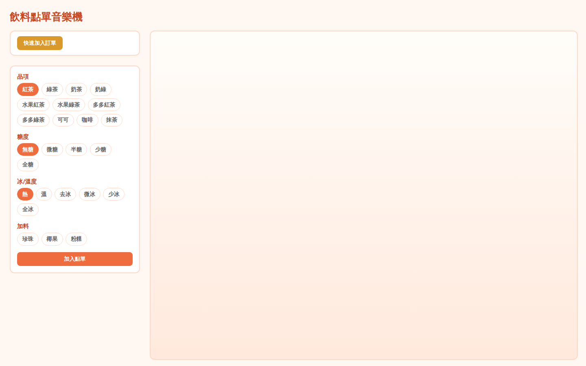
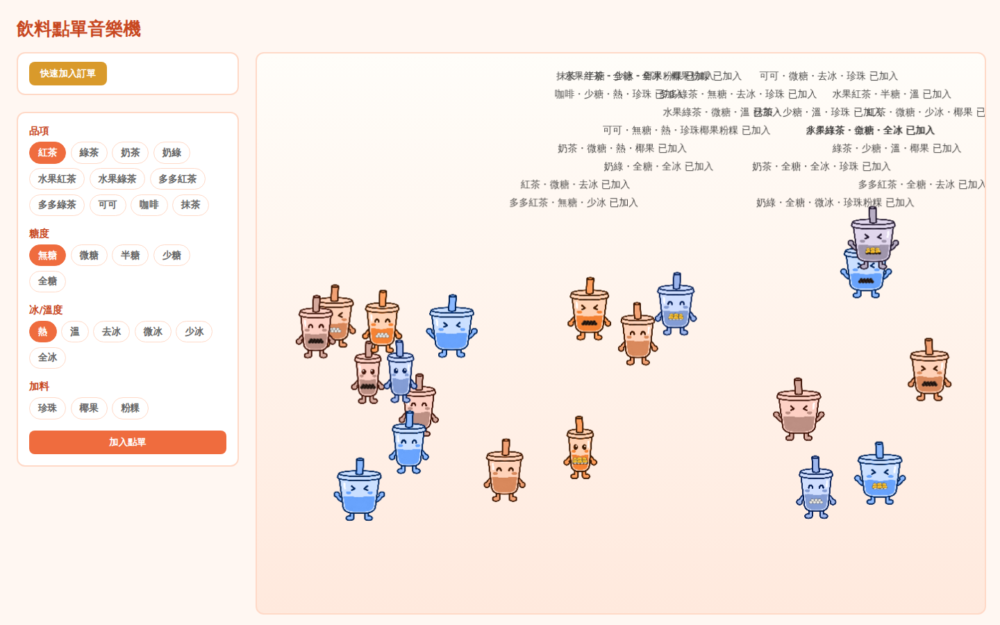

1.島嶼名稱：甜到快昏島

2.創作概念：
如果在未來的台灣，我們身邊的 《手搖飲料店》（場景/物件等），寄生了一種以 《訂單內容》（某種數據/動作/情緒等）為食物的數位生命體。 牠會以 《隨訂單內容改變歌曲》（動態變化）的方式與人與環境互動，最終讓人類體驗到一種 《與虛擬手搖市民一同創作店內音樂的同頻感》（一種極致 Chill 的狀態）的生活？

3.公開作品連結（可將混合器互動操作方式改為其他）：
https://shouldwang.github.io/ixda-workshop-2026/

4.作品截圖（3-5張照片）：

5.其他公開資訊
共同發想與共同創作：Winnie / Raphy
